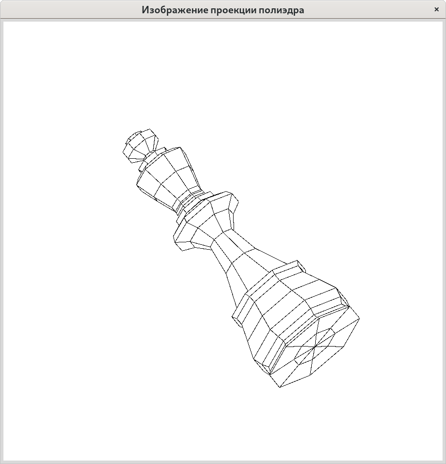

# Изображение проекции полиэдра

Построение изображения полиэдра с удалением невидимых линий — пример
классической задачи, для успешного решения которой необходимо знакомство
с основами вычислительной геометрии.

## Проверка соблюдения соглашений о стиле программного кода

~~~{.sh}
    find . -name '*.py' -exec pycodestyle {} \;
~~~

## Проверка покрытия тестами кода программы

~~~{.sh}
python -B -m coverage run -m unittest discover tests && coverage report -m ; rm -f .coverage
~~~

## Задача модификации
Все рёбра делятся на три класса: полностью видимые, видимые частично и 
полностью невидимые. Модифицируйте эталонный проект таким образом, чтобы 
определялась и печаталась следующая характеристика полиэдра: сумма длин 
проекций полностью невидимых рёбер, образующих с горизонтальной плоскостью 
угол не более центр которых находится строго вне куба единичного объёма 
с центром в начале координат и рёбрами, параллельными координатным осям.
